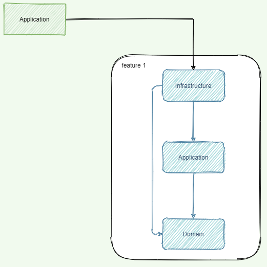

# About
This project contains helper schematics for generating unified structure of NestJS project which uses CQRS.

NX Monorepository is necessary to get expected results.

## Usage
Import this package as your dev dependencies:
`npm install --dev @stechy1/schematics`

Then to create new feature call `nx generate @stechy1/schematics:nest-lib feature-name`
where `feature-name` is the name of the feature.

This call will create the following structure in `libs` directory:
```
libs
|-- feature-name
    |-- application
    |   |-- src
    |   |   |-- lib
    |   |   |   |-- command
    |   |   |   |   |-- handlers
    |   |   |   |   |-- impl
    |   |   |   |   |-- index.ts
    |   |   |   |-- event
    |   |   |   |   |-- handlers
    |   |   |   |   |-- impl
    |   |   |   |   |-- index.ts
    |   |   |   |-- query
    |   |   |   |   |-- handlers
    |   |   |   |   |-- impl
    |   |   |   |   |-- index.ts
    |   |   |   |-- saga
    |   |   |   |   |-- index.ts
    |   |   |   |-- service
    |   |   |   |   |-- feature-name.service.ts
    |   |   |   |-- feature-name.application.module.ts
    |   |   |-- index.ts
    |-- domain
    |   |-- src
    |   |   |-- lib
    |   |   |   |-- exception
    |   |   |   |-- model
    |   |   |   |   |-- dto
    |   |   |   |   |   |-- index.ts
    |   |   |   |   |-- entity
    |   |   |   |   |   |-- index.ts
    |   |   |   |-- repository
    |   |   |   |-- feature-name.domain.module.ts
    |   |   |-- index.ts
    |-- infrastructure
    |   |-- src
    |   |   |-- lib
    |   |   |   |-- controller
    |   |   |   |   |-- feature-name.controller.ts
    |   |   |   |-- service
    |   |   |   |   |-- feature-name.facade.ts
    |   |   |   |-- feature-name.infrastructure.module.ts
    |   |   |-- index.ts
```

### Infrastructure part
The Infrastructure part is used as access point to the API. 
There are two folders: `controller` and `service` with already generated files with proper names. 
In **Controller** file, there is definition of API.
`Facade` is used only as connection layer between **Controller** and **CQRS**.


### Application part
The Application part is a place, where the core usage of CQRS is happening.
`impl` directory is for commands, events and queries definitions. `handlers` directory
is place where is implementation of each command, event or query.
Every handler of command, event, query or saga itself needs to be added to a constant in the `index.ts` file.

There is also a root `index.ts` of application part. In this file there are definitions of files,
which are provided by application part. Mainly there is a place for commands, events and queries definitions.

Do not export anything from service or saga. It should not be necessary.


### Domain part
The Domain part contains everything releated to domain. It includes `exceptions`, `repositories`,
`entities` and `DTOs`.
**Repositories**, **entities** and **DTOs** contains `index.ts` file. Every file created in
**Repositories**, **entities** or **DTOs** needs to be added to proper `index.ts` file.
In `feature-name.module.ts` file, repositories and entities are used in typeorm definition.


## Dependency graph
